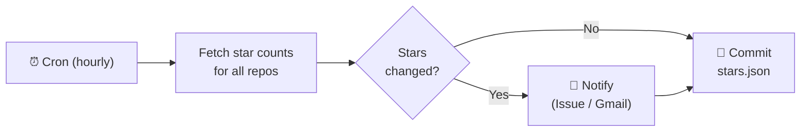
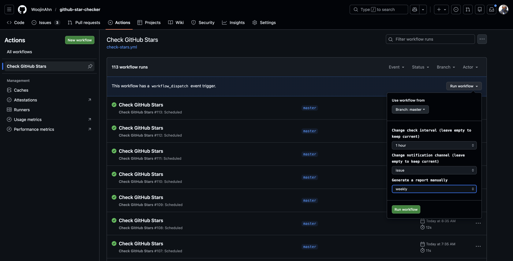
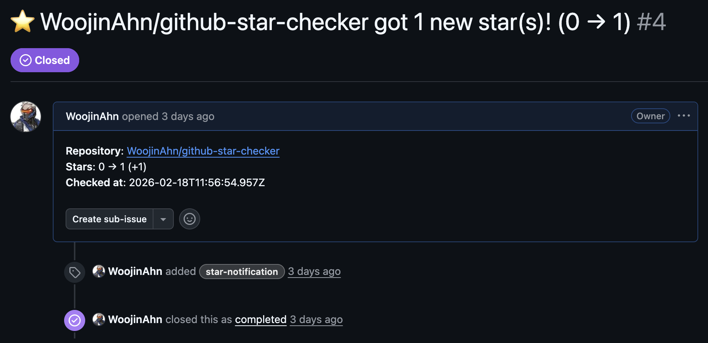
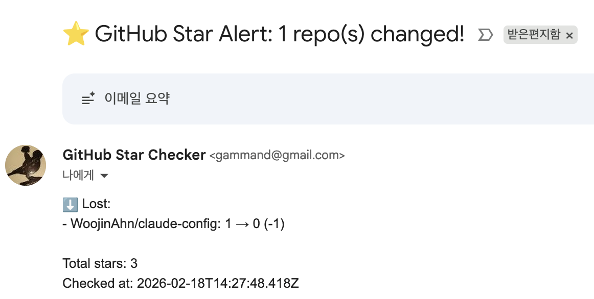
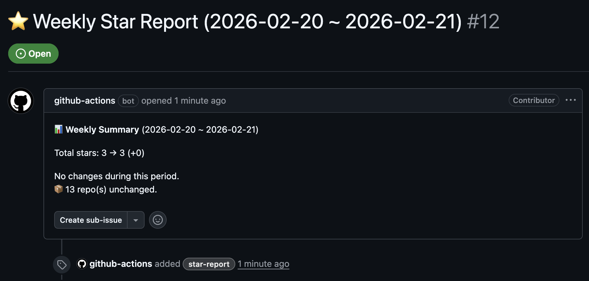

# GitHub Star Checker

[English](README.md)

GitHub 스타 변화를 자동으로 모니터링합니다. 스타가 증가하거나 감소하면 GitHub Issue 또는 Gmail로 알림을 받습니다.

> **의존성 0개 · GitHub Actions만 사용 · 워크플로우 파일 하나**

## 동작 방식



1. 기본 1시간마다 자동 실행 (`workflow_dispatch`로 간격 변경 가능)
2. 소유한 공개, 비포크(non-fork) 레포지토리의 스타 수를 조회
3. `stars.json`에 기록된 이전 수치와 비교
4. 스타 변화 시 알림 — GitHub Issue(기본) 또는 Gmail, `workflow_dispatch`로 변경 가능
5. 주간(월요일) / 월간(매월 1일) 스타 리포트 자동 생성
6. 갱신된 `stars.json`을 커밋하여 레포지토리에 반영

첫 실행 시에는 현재 스타 수만 기록하고 알림을 발송하지 않습니다.

## 빠른 시작

로컬 설치 없이 GitHub Actions에서 모두 동작합니다. Fork한 전용 레포에서 실행되므로 기존 레포지토리에 영향을 주지 않습니다.

1. **Fork** — 이 레포지토리를 Fork
2. **워크플로우 활성화** — Actions 탭에서 활성화 (Fork는 기본 비활성)
3. **시크릿 등록** — Settings > Secrets and variables > Actions에서 `STAR_MONITOR_TOKEN` 등록
4. **실행** — Actions 탭에서 수동 실행하거나, 다음 스케줄 실행을 대기

<table><tr><td>

</td></tr></table>

Actions 탭에서 체크 간격, 알림 채널 변경, 리포트 수동 생성이 가능합니다.

## 준비물

- [Classic Personal Access Token](https://github.com/settings/tokens/new) — `repo` + `workflow` 스코프
  > 기본 `GITHUB_TOKEN`은 현재 레포지토리만 접근 가능합니다. 전체 레포지토리 조회를 위해 별도 PAT이 필요합니다.
- *(선택)* Gmail [2단계 인증](https://myaccount.google.com/security) + [앱 비밀번호](https://myaccount.google.com/apppasswords) — `gmail` 또는 `both` 알림 채널 사용 시에만 필요

## 시크릿

| 시크릿 | 값 | 필수 |
|--------|-----|------|
| `STAR_MONITOR_TOKEN` | Classic PAT | Yes |
| `GMAIL_USER` | 발송용 Gmail 주소 | Gmail 사용 시 |
| `GMAIL_APP_PASSWORD` | Gmail 앱 비밀번호 | Gmail 사용 시 |
| `NOTIFY_EMAIL` | 알림 수신 이메일 주소 | Gmail 사용 시 |

또는 [GitHub CLI](https://cli.github.com/)로 등록:

```sh
gh secret set STAR_MONITOR_TOKEN
```

## 알림 예시

### GitHub Issue

<table><tr><td>

</td></tr></table>

### 이메일

<table><tr><td>

</td></tr></table>

```
제목: ⭐ GitHub Star Alert: 3 repo(s) changed!

⬆️ Gained:
- user/repo-a: 3 → 5 (+2)
- user/repo-b: 0 → 1 (+1)

⬇️ Lost:
- user/repo-c: 10 → 8 (-2)

Total stars: 42
Checked at: 2026-02-18T12:13:19Z
```

### 주간 / 월간 리포트

<table><tr><td>

</td></tr></table>

## 사용량 및 제한

GitHub Actions 무료 티어는 월 2,000분을 제공합니다. 이 워크플로우는 1회 실행에 약 10초 소요되므로, 기본 1시간 간격 실행 시 월 ~75분 사용합니다.

## 파일 구조

```
.github/workflows/check-stars.yml  # 워크플로우 (모든 로직 인라인)
stars.json                          # 최신 스타 수 (자동 갱신)
stars-history.json                  # 일별 스냅샷 (리포트용, 32일 보관)
```
