# GitHub Star Checker

[한국어](README.ko.md)

Monitor GitHub stars across all your repositories — automatically. Get notified via GitHub Issues or Gmail whenever stars change.

> **0 dependencies · GitHub Actions only · Single workflow file**

## How It Works

```mermaid
flowchart LR
    A["⏰ Cron (hourly)"] --> B["Fetch star counts\nfor all repos"]
    B --> C{"Stars\nchanged?"}
    C -->|Yes| D["🔔 Notify\n(Issue / Gmail)"]
    C -->|No| E["💾 Commit\nstars.json"]
    D --> E
```



1. Runs every hour by default (configurable via `workflow_dispatch`)
2. Fetches star counts for all public, non-fork repositories you own
3. Compares with previous counts stored in `stars.json`
4. Sends notifications on changes — GitHub Issue (default) or Gmail, switchable via `workflow_dispatch`
5. Generates weekly (Monday) and monthly (1st) star reports
6. Commits updated `stars.json` back to the repository

On the first run, it only records current counts — no notifications are sent.

## Quick Start

No local setup needed. Everything runs on GitHub Actions.

1. **Fork** this repository
2. **Enable workflows** in the Actions tab (disabled by default on forks)
3. **Add secret** `STAR_MONITOR_TOKEN` in Settings > Secrets and variables > Actions
4. **Run** the workflow manually, or wait for the next scheduled run

<table><tr><td>

</td></tr></table>

You can change the check interval, notification channel, and trigger reports manually from the Actions tab.

## Prerequisites

- [Classic Personal Access Token](https://github.com/settings/tokens/new) with `repo` + `workflow` scopes
  > The default `GITHUB_TOKEN` can only access the current repository. A separate PAT is needed to list all your repositories.
- *(Optional)* Gmail with [2-Step Verification](https://myaccount.google.com/security) + [App Password](https://myaccount.google.com/apppasswords) — only for `gmail` or `both` notification channel

## Secrets

| Secret | Value | Required |
|--------|-------|----------|
| `STAR_MONITOR_TOKEN` | Classic PAT | Yes |
| `GMAIL_USER` | Gmail address for sending | Only for Gmail |
| `GMAIL_APP_PASSWORD` | Gmail app password | Only for Gmail |
| `NOTIFY_EMAIL` | Email address to receive notifications | Only for Gmail |

Or via [GitHub CLI](https://cli.github.com/):

```sh
gh secret set STAR_MONITOR_TOKEN
```

## Notification Examples

### GitHub Issue

<table><tr><td>

</td></tr></table>

### Email

<table><tr><td>

</td></tr></table>

```
Subject: ⭐ GitHub Star Alert: 3 repo(s) changed!

⬆️ Gained:
- user/repo-a: 3 → 5 (+2)
- user/repo-b: 0 → 1 (+1)

⬇️ Lost:
- user/repo-c: 10 → 8 (-2)

Total stars: 42
Checked at: 2026-02-18T12:13:19Z
```

### Weekly / Monthly Report

<table><tr><td>

</td></tr></table>

## Usage & Limits

GitHub Actions free tier provides 2,000 minutes/month. This workflow takes ~10 seconds per run, so the default hourly schedule uses ~75 minutes/month.

## File Structure

```
.github/workflows/check-stars.yml  # Workflow (all logic inline)
stars.json                          # Latest star counts (auto-updated)
stars-history.json                  # Daily snapshots for reports (32-day retention)
```
